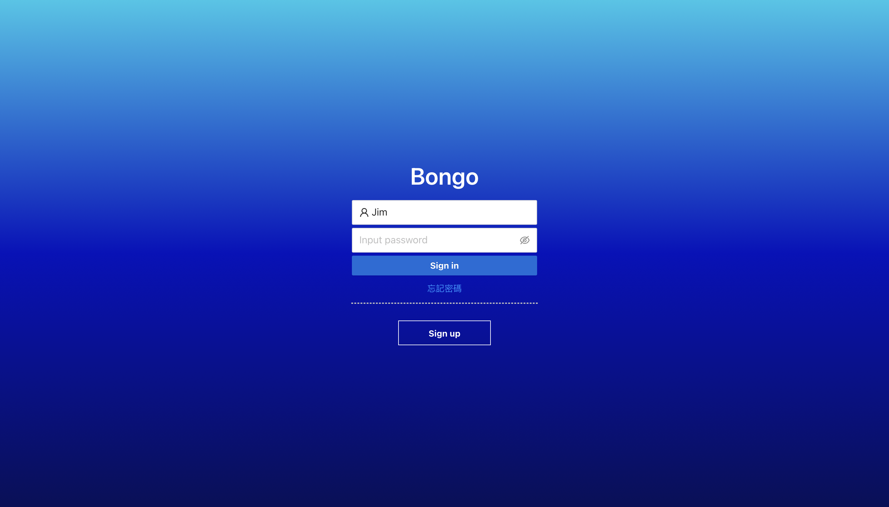

# Bongo



## Demo

[Demo Link](https://www.youtube.com/watch?v=i_phRIS7DYs)

## Deploy

[Deploy Link](...)

## Introduction

Bongo is a facebook-like online social media which provide a platform for users to interact with each other.

## Main function

- Users **sign up** and **log in**.
- Backend **password encryption** by bcrypt.
- Frontend **save user_id** by local storage.
- Allow users to **stay logged in**.
- Can **send friend request**、**accept friend request** or **reject friend request**.
- Can **write post**、**edit post** or **delete post**.
- Can **like**、**unlike**、**comment** or **uncomment** on post.
- Support three post modes: **public**、**friends** and **private**.
- Can **create chatroom**、**add room members**、**customize room name** or **leave chatroom**.
- Can **send message** or **delete message** in chatroom.
- Support three chatroom types: **self**、**one2one** and **many2many**.
- Support **new message informing**、**chatroom switching** and **notifications**.
- Can **update info**、**upload profile picture** or **visit someone's homepage**.

## **Run in Local**

1. Clone the repository and install the required packages:

   ```bash
   git clone https://github.com/b06608062/Bongo.git
   cd ./Bongo
   nvm use 12.22.12
   npm install
   npm run build
   ```

2. Create a `.env` file and set the **MONGO_URL** to your MongoDB URL (refer to [.env.defaults](https://github.com/b06608062/Bongo/blob/master/.env.defaults) for guidance).

3. Start the application by running:

   ```bash
   npm run start
   ```

4. Open [http://localhost:80](http://localhost:80) in your browser to view the application.
